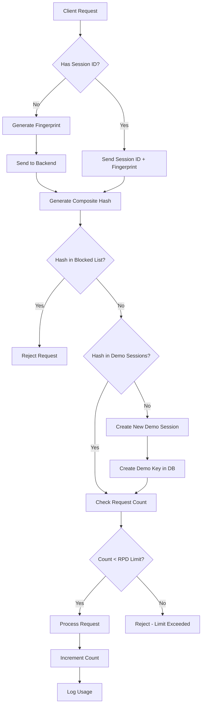
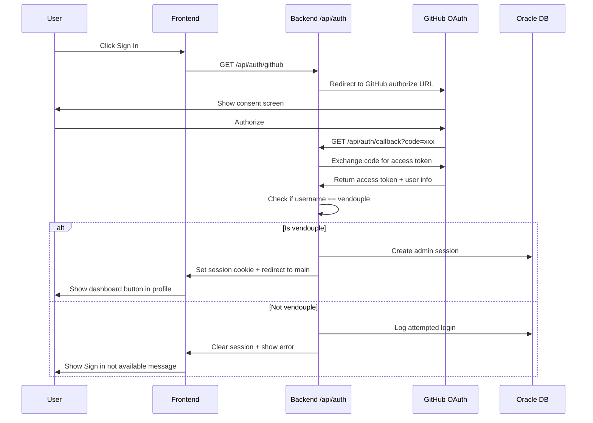

# Backend Addition Plan for OrchidLLM

## Overview

Add a Vercel serverless backend to the existing static frontend (HTML/CSS/JS) with Oracle Database for API key management, usage tracking, and GitHub authentication. **No frontend migration required** - the static files remain unchanged.

## Key Types Summary

| Key Type | Storage | Limits | Notes |
|----------|---------|--------|-------|
| **Demo** | Oracle DB | 5 RPM, 20 RPD, 10k input tokens | Auto-generated per device, cleaned after 30 days inactivity |
| **Global** | Oracle DB | Custom (admin-defined) | Created by admin via dashboard |
| **BYOP** | localStorage only | None (bypass all) | User's own Pollinations key, never touches DB |

## Current Architecture

```
Current State:
Browser (index.html + index.js + styles.css)
    |
    v
Direct API calls to gen.pollinations.ai (exposes API key!)
```

## New Architecture

```
New State:
Browser (static HTML/CSS/JS)
    |
    v
Vercel Serverless Functions (/api/*)
    |
    +---> Oracle DB (API keys + usage tracking + auth)
    |
    +---> GitHub OAuth (admin authentication)
    |
    +---> External APIs (Pollinations, NVIDIA NIM)
```

## Architecture Diagram

```mermaid
flowchart TB
    subgraph Client [Browser - Static Files]
        HTML[index.html]
        JS[index.js]
        CSS[styles.css]
        LocalStore[localStorage - BYOP key]
    end

    subgraph Vercel [Vercel Serverless]
        API[/api/* routes]
        AUTH[/api/auth - GitHub OAuth]
        PING[/api/ping - Keep Awake]
        ADMIN[/api/admin - Dashboard]
    end

    subgraph Oracle [Oracle Cloud Always Free]
        DB[(Oracle DB)]
        KEYS[api_keys table]
        USAGE[usage_logs table]
        SESSIONS[sessions table]
    end

    subgraph GitHub [GitHub OAuth]
        GH[GitHub API]
        VENDOUPLE[vendouple account - Admin Only]
    end

    subgraph External [External APIs]
        Pollinations[gen.pollinations.ai]
        NVIDIA[NVIDIA NIM API]
    end

    Client -->|fetch calls| API
    Client -->|OAuth flow| AUTH
    AUTH -->|verify user| GH
    GH -->|only vendouple allowed| VENDOUPLE
    AUTH -->|create session| SESSIONS
    API -->|validate keys| KEYS
    API -->|track usage| USAGE
    API -->|proxy requests| Pollinations
    API -->|proxy requests| NVIDIA
    ADMIN -->|manage keys| KEYS
    ADMIN -->|view usage| USAGE
    PING -->|SELECT 1 FROM DUAL| DB
    PING -.->|Cron: daily at noon| Vercel
```

## Project Structure

```
OneLLM/
# Existing static files (unchanged)
index.html
index.js
styles.css
models.json
suggestionstrip.json
app.js              # Will be modified to call backend instead of direct API

# New backend files
api/
  auth/
    github.js       # GET/POST /api/auth/github - OAuth flow
    callback.js     # GET /api/auth/callback - OAuth callback
    logout.js       # POST /api/auth/logout
    session.js      # GET /api/auth/session - Check current session
  chat/
    completions.js  # POST /api/chat/completions
  images/
    generations.js  # POST /api/images/generations
  video/
    generations.js  # POST /api/video/generations
  audio/
    speech.js       # POST /api/audio/speech
    transcriptions.js # POST /api/audio/transcriptions
  models.js         # GET /api/models
  ping.js           # GET /api/ping - Keep DB awake
  keys.js           # API key CRUD endpoints
  admin/
    dashboard.js    # GET /api/admin/dashboard - Stats and key management
    keys.js         # POST/PUT/DELETE /api/admin/keys - Key management

lib/
  oracle.js         # Oracle DB connection pool
  usage.js          # Usage tracking functions
  keys.js           # API key validation functions
  fingerprint.js    # Browser fingerprinting for anti-abuse
  tokenizer.js      # Token counting using tiktoken
  auth.js           # GitHub OAuth helpers

vercel.json         # Vercel config with cron jobs
package.json        # Node.js dependencies
.env.example        # Environment variables template
```

## Oracle DB Schema

### Table: API_KEYS

```sql
CREATE TABLE api_keys (
    id NUMBER GENERATED ALWAYS AS IDENTITY PRIMARY KEY,
    key VARCHAR2(64) NOT NULL UNIQUE,
    name VARCHAR2(100) NOT NULL,           -- Friendly name for the key
    key_type VARCHAR2(20) NOT NULL,        -- 'demo', 'global', 'byop'
    
    -- Rate Limits
    rpm NUMBER DEFAULT 5,                  -- Requests per minute
    rpd NUMBER DEFAULT 20,                 -- Requests per day
    
    -- Token Limits (-1 = unlimited/disabled)
    input_token_limit NUMBER DEFAULT 10000,  -- Max input tokens
    output_token_limit NUMBER DEFAULT -1,    -- Max output tokens (-1 = disabled)
    
    -- Queue System (for future implementation)
    queue_priority NUMBER DEFAULT 0,       -- 0 = lowest, -1 = highest/always priority
    
    -- Access Control
    providers VARCHAR2(4000),              -- JSON array: ['nvidia', 'pollinations']
    allowed_models VARCHAR2(4000),         -- JSON array or '*' for wildcard
    
    -- Metadata
    expires_at TIMESTAMP,
    created_at TIMESTAMP DEFAULT CURRENT_TIMESTAMP,
    created_by VARCHAR2(255),              -- GitHub username or 'system'
    last_used TIMESTAMP,
    usage_count NUMBER DEFAULT 0,
    is_active NUMBER DEFAULT 1,            -- 1 = active, 0 = revoked
    
    -- Token Usage Tracking
    total_input_tokens NUMBER DEFAULT 0,
    total_output_tokens NUMBER DEFAULT 0
);

-- Indexes for fast lookup
CREATE INDEX idx_api_keys_key ON api_keys(key);
CREATE INDEX idx_api_keys_active ON api_keys(is_active, expires_at);
CREATE INDEX idx_api_keys_type ON api_keys(key_type);
```

### Table: USAGE_LOGS

```sql
CREATE TABLE usage_logs (
    id NUMBER GENERATED ALWAYS AS IDENTITY PRIMARY KEY,
    identifier VARCHAR2(255) NOT NULL,     -- session_id or composite hash
    api_key_id NUMBER,                     -- foreign key to api_keys (nullable for demo)
    
    -- Request Details
    endpoint VARCHAR2(100) NOT NULL,       -- '/chat/completions', '/images/generations'
    model VARCHAR2(100),
    
    -- Token Tracking
    input_tokens NUMBER DEFAULT 0,
    output_tokens NUMBER DEFAULT 0,
    
    -- Anti-Abuse Tracking
    ip_address VARCHAR2(45),
    fingerprint_hash VARCHAR2(64),         -- Browser fingerprint hash
    user_agent VARCHAR2(500),
    
    -- Timestamp
    created_at TIMESTAMP DEFAULT CURRENT_TIMESTAMP,
    
    CONSTRAINT fk_usage_api_key FOREIGN KEY (api_key_id) REFERENCES api_keys(id)
);

-- Indexes for usage queries
CREATE INDEX idx_usage_identifier_date ON usage_logs(identifier, created_at);
CREATE INDEX idx_usage_api_key ON usage_logs(api_key_id);
CREATE INDEX idx_usage_fingerprint ON usage_logs(fingerprint_hash, created_at);
CREATE INDEX idx_usage_ip ON usage_logs(ip_address, created_at);
```

### Table: SESSIONS (GitHub Auth)

```sql
CREATE TABLE sessions (
    id VARCHAR2(64) PRIMARY KEY,           -- Session token
    github_id NUMBER,                      -- GitHub user ID
    github_username VARCHAR2(100),         -- GitHub username
    github_avatar VARCHAR2(500),           -- Avatar URL
    is_admin NUMBER DEFAULT 0,             -- 1 if vendouple
    created_at TIMESTAMP DEFAULT CURRENT_TIMESTAMP,
    expires_at TIMESTAMP,
    last_accessed TIMESTAMP
);

CREATE INDEX idx_sessions_github ON sessions(github_id);
CREATE INDEX idx_sessions_expires ON sessions(expires_at);
```

### Table: DEMO_SESSIONS (Anti-Abuse)

```sql
CREATE TABLE demo_sessions (
    id NUMBER GENERATED ALWAYS AS IDENTITY PRIMARY KEY,
    composite_hash VARCHAR2(64) NOT NULL UNIQUE,  -- hash(fingerprint + ip + date)
    fingerprint_hash VARCHAR2(64) NOT NULL,
    ip_address VARCHAR2(45),
    user_agent VARCHAR2(500),
    first_seen TIMESTAMP DEFAULT CURRENT_TIMESTAMP,
    last_seen TIMESTAMP,
    request_count NUMBER DEFAULT 0,
    is_blocked NUMBER DEFAULT 0            -- Flag for suspicious activity
);

CREATE INDEX idx_demo_composite ON demo_sessions(composite_hash);
CREATE INDEX idx_demo_fingerprint ON demo_sessions(fingerprint_hash);
CREATE INDEX idx_demo_blocked ON demo_sessions(is_blocked);
```

## API Key System

### Key Types

| Key Type | Storage | Format | RPM | RPD | Input Limit | Output Limit | Queue Priority |
|----------|---------|--------|-----|-----|-------------|--------------|----------------|
| **Demo** | Oracle DB | `nobindes_<timestamp>_<random>` | 5 | 20 | 10k | -1 (disabled) | 0 (lowest) |
| **Global** | Oracle DB | `nobindes_<32-byte-hex>` | Custom | Custom | Custom | Custom | Custom |
| **BYOP** | localStorage only | `BYOP_<sk_xxx or pk_xxx>` | -1 | -1 | -1 | -1 | -1 (highest) |

**Important Notes:**

- **BYOP keys are NEVER stored in the database** - they remain in the user's browser localStorage
- **Demo keys are auto-cleaned** after 30 days of inactivity to save DB storage
- The `BYOP_` prefix allows the backend to recognize it's a Pollinations key and bypass all limits
- Future key format changes won't break the system - backend just checks for `BYOP_` prefix

### Key Format Detection

```javascript
// lib/keys.js
function detectKeyType(apiKey) {
    // BYOP: User's own Pollinations key
    if (apiKey.startsWith('BYOP_sk_') || apiKey.startsWith('BYOP_pk_')) {
        return {
            type: 'byop',
            actualKey: apiKey.replace('BYOP_', ''),
            bypassLimits: true
        };
    }
    
    // nobindes keys
    if (apiKey.startsWith('nobindes_')) {
        const keyBody = apiKey.replace('nobindes_', '');
        
        // Demo session: short format with underscore (timestamp_random)
        if (keyBody.includes('_') && keyBody.length < 30) {
            return { type: 'demo', needsDbValidation: true };
        }
        
        // Global API key: long format
        return { type: 'global', needsDbValidation: true };
    }
    
    return { type: 'unknown' };
}
```

### Default Demo Key Generation

```javascript
// lib/keys.js
function generateDemoKeyName() {
    return 'Default API Key';  // All demo keys have this name
}

async function createDemoKey(compositeHash) {
    const key = `nobindes_${Date.now()}_${Math.random().toString(36).slice(2, 15)}`;
    
    await connection.execute(
        `INSERT INTO api_keys (key, name, key_type, rpm, rpd, input_token_limit, output_token_limit, queue_priority, created_by)
         VALUES (:key, 'Default API Key', 'demo', 5, 20, 10000, -1, 0, :createdBy)`,
        { key, createdBy: compositeHash },
        { autoCommit: true }
    );
    
    return key;
}
```

## Anti-Abuse System

### Fingerprint + IP Combo

```javascript
// lib/fingerprint.js

/**
 * Generate browser fingerprint on client side
 * Sent to backend for composite hash generation
 */
export function generateFingerprint() {
    const components = {
        // Canvas fingerprint
        canvas: getCanvasFingerprint(),
        // WebGL info
        webgl: getWebGLFingerprint(),
        // Audio context
        audio: getAudioFingerprint(),
        // Screen info
        screen: {
            width: screen.width,
            height: screen.height,
            colorDepth: screen.colorDepth,
            devicePixelRatio: window.devicePixelRatio
        },
        // Timezone
        timezone: Intl.DateTimeFormat().resolvedOptions().timeZone,
        timezoneOffset: new Date().getTimezoneOffset(),
        // Language
        language: navigator.language,
        languages: navigator.languages?.join(','),
        // Platform
        platform: navigator.platform,
        hardwareConcurrency: navigator.hardwareConcurrency,
        deviceMemory: navigator.deviceMemory,
        // Touch support
        touchSupport: {
            maxTouchPoints: navigator.maxTouchPoints,
            touchEvent: 'ontouchstart' in window
        }
    };
    
    return components;
}

/**
 * Server-side: Generate composite hash for tracking
 * Combines fingerprint + IP + date for robust tracking
 */
export async function generateCompositeHash(fingerprint, ip, userAgent) {
    const encoder = new TextEncoder();
    const data = JSON.stringify({
        canvas: fingerprint.canvas,
        webgl: fingerprint.webgl.renderer,  // Only use renderer for stability
        screen: `${fingerprint.screen.width}x${fingerprint.screen.height}`,
        timezone: fingerprint.timezone,
        ip: ip,
        date: new Date().toDateString()  // Changes daily, so same device gets fresh limit
    });
    
    const hashBuffer = await crypto.subtle.digest('SHA-256', encoder.encode(data));
    const hashArray = Array.from(new Uint8Array(hashBuffer));
    return hashArray.map(b => b.toString(16).padStart(2, '0')).join('');
}
```

### Anti-Abuse Flow



### Why This Works Against Abuse

| Attack Vector | Mitigation |
|---------------|------------|
| **Key Deletion** | Composite hash stored in DB, not just localStorage |
| **VPN** | Fingerprint remains same, IP changes but hash includes fingerprint |
| **Browser Change** | New fingerprint = new session (acceptable, each browser gets 20 RPD) |
| **Device Change** | New fingerprint = new session (acceptable, each device gets 20 RPD) |
| **Incognito Mode** | New fingerprint likely, but limited by IP + fingerprint combo |
| **Multiple Browsers** | Each browser gets its own 20 RPD (acceptable behavior) |

## GitHub Authentication

### OAuth Flow



### Auth Implementation

```javascript
// api/auth/github.js
export default async function handler(req, res) {
    const { code } = req.query;
    
    if (!code) {
        // Step 1: Redirect to GitHub
        const params = new URLSearchParams({
            client_id: process.env.GITHUB_CLIENT_ID,
            redirect_uri: `${process.env.BASE_URL}/api/auth/callback`,
            scope: 'read:user user:email',
            state: generateState()
        });
        
        return res.redirect(`https://github.com/login/oauth/authorize?${params}`);
    }
}

// api/auth/callback.js
import { getConnection } from '../../lib/oracle.js';

export default async function handler(req, res) {
    const { code, state } = req.query;
    
    // Exchange code for token
    const tokenRes = await fetch('https://github.com/login/oauth/access_token', {
        method: 'POST',
        headers: { 'Content-Type': 'application/json', 'Accept': 'application/json' },
        body: JSON.stringify({
            client_id: process.env.GITHUB_CLIENT_ID,
            client_secret: process.env.GITHUB_CLIENT_SECRET,
            code
        })
    });
    
    const { access_token } = await tokenRes.json();
    
    // Get user info
    const userRes = await fetch('https://api.github.com/user', {
        headers: { Authorization: `Bearer ${access_token}` }
    });
    const user = await userRes.json();
    
    // Check if vendouple
    if (user.login !== 'vendouple') {
        // Not authorized - sign out immediately
        return res.redirect('/?error=signin_unavailable');
    }
    
    // Create session
    const sessionId = generateSessionToken();
    const connection = await getConnection();
    
    await connection.execute(
        `INSERT INTO sessions (id, github_id, github_username, github_avatar, is_admin, expires_at)
         VALUES (:id, :githubId, :username, :avatar, 1, SYSDATE + 7)`,
        { id: sessionId, githubId: user.id, username: user.login, avatar: user.avatar_url },
        { autoCommit: true }
    );
    
    // Set cookie
    res.setHeader('Set-Cookie', `session=${sessionId}; Path=/; HttpOnly; Secure; SameSite=Lax; Max-Age=604800`);
    
    return res.redirect('/');
}
```

### Frontend Sign-In Handling

```javascript
// In index.js - Handle sign-in state

// Check session on load
async function checkSession() {
    try {
        const res = await fetch('/api/auth/session');
        const data = await res.json();
        
        if (data.authenticated && data.isAdmin) {
            // Show admin UI
            updateUserUI(data.user);
            showDashboardButton();
        } else if (data.error === 'signin_unavailable') {
            // Show error message
            showSignInUnavailableMessage();
        }
    } catch (e) {
        // Not signed in
        updateUIToSignedOut();
    }
}

function showSignInUnavailableMessage() {
    // Show toast or dialog
    showToast({
        message: 'Sign in feature is currently not available for your account. Stay tuned!',
        type: 'info',
        duration: 5000
    });
    
    // Clear any partial session
    fetch('/api/auth/logout', { method: 'POST' });
}

function showDashboardButton() {
    // Add dashboard option to profile dropdown
    const profileBtn = document.querySelector('.user-avatar');
    profileBtn.addEventListener('click', () => {
        window.location.href = '/admin';
    });
}
```

## Admin Dashboard

### Dashboard Route

```javascript
// api/admin/dashboard.js
import { getConnection } from '../../lib/oracle.js';
import { validateSession } from '../../lib/auth.js';

export default async function handler(req, res) {
    // Verify admin session
    const session = await validateSession(req.cookies.session);
    if (!session || !session.isAdmin) {
        return res.status(401).json({ error: 'Unauthorized' });
    }
    
    const connection = await getConnection();
    
    // Get stats
    const stats = await connection.execute(`
        SELECT 
            (SELECT COUNT(*) FROM api_keys WHERE is_active = 1) as active_keys,
            (SELECT COUNT(*) FROM api_keys WHERE key_type = 'demo' AND is_active = 1) as demo_keys,
            (SELECT COUNT(*) FROM usage_logs WHERE TRUNC(created_at) = TRUNC(SYSDATE)) as requests_today,
            (SELECT SUM(input_tokens + output_tokens) FROM usage_logs) as total_tokens
        FROM DUAL
    `);
    
    // Get all keys
    const keys = await connection.execute(`
        SELECT key, name, key_type, rpm, rpd, input_token_limit, output_token_limit,
               queue_priority, usage_count, total_input_tokens, total_output_tokens,
               created_at, last_used, is_active
        FROM api_keys
        ORDER BY created_at DESC
    `);
    
    // Get recent usage
    const recentUsage = await connection.execute(`
        SELECT identifier, endpoint, model, input_tokens, output_tokens, created_at
        FROM usage_logs
        ORDER BY created_at DESC
        FETCH FIRST 100 ROWS ONLY
    `);
    
    res.status(200).json({
        stats: stats.rows[0],
        keys: keys.rows,
        recentUsage: recentUsage.rows
    });
}
```

### Key Management API

```javascript
// api/admin/keys.js
import { getConnection } from '../../lib/oracle.js';
import { validateSession } from '../../lib/auth.js';
import crypto from 'crypto';

// Create new key
export async function POST(req, res) {
    const session = await validateSession(req.cookies.session);
    if (!session?.isAdmin) {
        return res.status(401).json({ error: 'Unauthorized' });
    }
    
    const { name, rpm, rpd, inputTokenLimit, outputTokenLimit, queuePriority, providers, allowedModels, expiresInDays } = req.body;
    
    const key = `nobindes_${crypto.randomBytes(32).toString('hex')}`;
    const connection = await getConnection();
    
    await connection.execute(
        `INSERT INTO api_keys (key, name, key_type, rpm, rpd, input_token_limit, output_token_limit, 
         queue_priority, providers, allowed_models, expires_at, created_by)
         VALUES (:key, :name, 'global', :rpm, :rpd, :inputLimit, :outputLimit, :queue, :providers, :models, 
         CASE WHEN :expiresIn IS NOT NULL THEN SYSDATE + :expiresIn ELSE NULL END, :createdBy)`,
        {
            key, name, rpm, rpd, inputLimit: inputTokenLimit, outputLimit: outputTokenLimit,
            queue: queuePriority, providers: JSON.stringify(providers),
            models: JSON.stringify(allowedModels), expiresIn: expiresInDays,
            createdBy: session.githubUsername
        },
        { autoCommit: true }
    );
    
    res.status(201).json({ key, name });
}

// Update key
export async function PUT(req, res) {
    const session = await validateSession(req.cookies.session);
    if (!session?.isAdmin) {
        return res.status(401).json({ error: 'Unauthorized' });
    }
    
    const { keyId, ...updates } = req.body;
    const connection = await getConnection();
    
    // Build dynamic update
    const setClauses = [];
    const bindVars = { id: keyId };
    
    if (updates.rpm !== undefined) { setClauses.push('rpm = :rpm'); bindVars.rpm = updates.rpm; }
    if (updates.rpd !== undefined) { setClauses.push('rpd = :rpd'); bindVars.rpd = updates.rpd; }
    if (updates.inputTokenLimit !== undefined) { setClauses.push('input_token_limit = :itl'); bindVars.itl = updates.inputTokenLimit; }
    if (updates.outputTokenLimit !== undefined) { setClauses.push('output_token_limit = :otl'); bindVars.otl = updates.outputTokenLimit; }
    if (updates.queuePriority !== undefined) { setClauses.push('queue_priority = :qp'); bindVars.qp = updates.queuePriority; }
    if (updates.isActive !== undefined) { setClauses.push('is_active = :active'); bindVars.active = updates.isActive ? 1 : 0; }
    
    await connection.execute(
        `UPDATE api_keys SET ${setClauses.join(', ')} WHERE id = :id`,
        bindVars,
        { autoCommit: true }
    );
    
    res.status(200).json({ success: true });
}

// Delete/Revoke key
export async function DELETE(req, res) {
    const session = await validateSession(req.cookies.session);
    if (!session?.isAdmin) {
        return res.status(401).json({ error: 'Unauthorized' });
    }
    
    const { keyId } = req.query;
    const connection = await getConnection();
    
    await connection.execute(
        `UPDATE api_keys SET is_active = 0 WHERE id = :id`,
        { id: keyId },
        { autoCommit: true }
    );
    
    res.status(200).json({ success: true });
}
```

## Token Tracking

### Using Tiktoken for Accurate Counting

```javascript
// lib/tokenizer.js
import { encoding_for_model } from 'tiktoken';

let encoder = null;

async function getEncoder() {
    if (!encoder) {
        // Use cl100k_base encoding (GPT-4/ChatGPT compatible)
        encoder = await encoding_for_model('gpt-4');
    }
    return encoder;
}

export async function countTokens(text) {
    const enc = await getEncoder();
    const tokens = enc.encode(text);
    return tokens.length;
}

export async function countMessagesTokens(messages) {
    const enc = await getEncoder();
    let total = 0;
    
    for (const msg of messages) {
        // Message overhead: ~4 tokens per message
        total += 4;
        total += enc.encode(msg.role || '').length;
        total += enc.encode(msg.content || '').length;
    }
    
    // Reply priming
    total += 2;
    
    return total;
}

// Free encoder on process exit
process.on('beforeExit', async () => {
    if (encoder) {
        await encoder.free();
    }
});
```

### Token Limit Enforcement

```javascript
// lib/usage.js
import { countMessagesTokens, countTokens } from './tokenizer.js';

export async function checkTokenLimits(apiKeyId, messages, estimatedOutputTokens = 0) {
    const connection = await getConnection();
    
    // Get key limits
    const result = await connection.execute(
        `SELECT input_token_limit, output_token_limit, total_input_tokens, total_output_tokens
         FROM api_keys WHERE id = :id`,
        { id: apiKeyId }
    );
    
    if (result.rows.length === 0) return { allowed: true };
    
    const limits = result.rows[0];
    const inputTokens = await countMessagesTokens(messages);
    
    // Check input limit (-1 = disabled/unlimited)
    if (limits.INPUT_TOKEN_LIMIT !== -1) {
        if (inputTokens > limits.INPUT_TOKEN_LIMIT) {
            return {
                allowed: false,
                reason: `Input exceeds limit: ${inputTokens} > ${limits.INPUT_TOKEN_LIMIT} tokens`
            };
        }
        
        // Check cumulative input usage
        if (limits.TOTAL_INPUT_TOKENS + inputTokens > limits.INPUT_TOKEN_LIMIT) {
            return {
                allowed: false,
                reason: `Cumulative input limit exceeded`
            };
        }
    }
    
    // Check output limit (-1 = disabled/unlimited)
    if (limits.OUTPUT_TOKEN_LIMIT !== -1 && estimatedOutputTokens > 0) {
        if (limits.TOTAL_OUTPUT_TOKENS + estimatedOutputTokens > limits.OUTPUT_TOKEN_LIMIT) {
            return {
                allowed: false,
                reason: `Output limit would be exceeded`
            };
        }
    }
    
    return { allowed: true, inputTokens };
}

export async function recordTokenUsage(apiKeyId, inputTokens, outputTokens) {
    const connection = await getConnection();
    
    await connection.execute(
        `UPDATE api_keys 
         SET total_input_tokens = total_input_tokens + :input,
             total_output_tokens = total_output_tokens + :output,
             last_used = SYSDATE,
             usage_count = usage_count + 1
         WHERE id = :id`,
        { id: apiKeyId, input: inputTokens, output: outputTokens },
        { autoCommit: true }
    );
}
```

## API Routes Implementation

### /api/chat/completions.js

```javascript
// api/chat/completions.js
import { getConnection } from '../../lib/oracle.js';
import { detectKeyType, validateApiKey } from '../../lib/keys.js';
import { checkRateLimit, logUsage, generateCompositeHash, checkDemoSession } from '../../lib/usage.js';
import { checkTokenLimits, recordTokenUsage, countMessagesTokens, countTokens } from '../../lib/tokenizer.js';

const POLLINATIONS_BASE = 'https://gen.pollinations.ai/v1';
const NVIDIA_BASE = 'https://integrate.api.nvidia.com/v1';

export default async function handler(req, res) {
    if (req.method !== 'POST') {
        return res.status(405).json({ error: 'Method not allowed' });
    }

    // Get identifiers
    const sessionId = req.headers['x-session-id'];
    const authHeader = req.headers['authorization'];
    const apiKey = authHeader?.replace('Bearer ', '');
    const clientIP = req.headers['x-forwarded-for'] || req.connection.remoteAddress;
    const fingerprint = req.headers['x-fingerprint'];  // JSON string from client
    const userAgent = req.headers['user-agent'];

    try {
        let keyInfo = null;
        let identifier = null;
        
        // Determine key type and validate
        if (apiKey) {
            const keyType = detectKeyType(apiKey);
            
            if (keyType.type === 'byop') {
                // BYOP - bypass all limits, direct passthrough
                keyInfo = {
                    type: 'byop',
                    actualKey: keyType.actualKey,
                    bypassLimits: true
                };
                identifier = `byop:${apiKey.substring(0, 20)}...`;
            } else if (keyType.needsDbValidation) {
                // Demo or Global key - validate in DB
                keyInfo = await validateApiKey(apiKey);
                if (!keyInfo) {
                    return res.status(401).json({ error: 'Invalid API key' });
                }
                identifier = `key:${apiKey}`;
            }
        } else {
            // No API key - use demo mode with anti-abuse
            const fingerprintObj = fingerprint ? JSON.parse(fingerprint) : {};
            const compositeHash = await generateCompositeHash(fingerprintObj, clientIP, userAgent);
            
            // Check/create demo session
            const demoSession = await checkDemoSession(compositeHash, fingerprintObj, clientIP, userAgent);
            if (demoSession.isBlocked) {
                return res.status(429).json({ error: 'Session blocked due to suspicious activity' });
            }
            
            keyInfo = {
                type: 'demo',
                id: demoSession.apiKeyId,
                rpm: 5,
                rpd: 20,
                inputTokenLimit: 10000,
                outputTokenLimit: -1
            };
            identifier = `demo:${compositeHash}`;
        }

        // Check rate limits (skip for BYOP)
        if (!keyInfo.bypassLimits) {
            const rateLimitOk = await checkRateLimit(identifier, keyInfo.rpm, keyInfo.rpd);
            if (!rateLimitOk.allowed) {
                return res.status(429).json({
                    error: 'Rate limit exceeded',
                    message: `Limit: ${keyInfo.rpm} RPM, ${keyInfo.rpd} RPD`,
                    resetAt: rateLimitOk.resetAt
                });
            }
        }

        const body = req.body;
        const { model, messages, stream } = body;

        // Check token limits (skip for BYOP)
        let inputTokens = 0;
        if (!keyInfo.bypassLimits && keyInfo.inputTokenLimit !== -1) {
            const tokenCheck = await checkTokenLimits(keyInfo.id, messages);
            if (!tokenCheck.allowed) {
                return res.status(400).json({ error: tokenCheck.reason });
            }
            inputTokens = tokenCheck.inputTokens;
        }

        // Route to appropriate provider
        let targetUrl, targetKey;
        if (model.startsWith('nvidia/')) {
            targetUrl = NVIDIA_BASE;
            targetKey = process.env.NVIDIA_API_KEY;
            body.model = model.replace('nvidia/', '');
        } else {
            targetUrl = POLLINATIONS_BASE;
            targetKey = keyInfo.type === 'byop'
                ? keyInfo.actualKey
                : process.env.POLLINATIONS_API_KEY;
        }

        // Forward request
        const response = await fetch(`${targetUrl}/chat/completions`, {
            method: 'POST',
            headers: {
                'Content-Type': 'application/json',
                'Authorization': `Bearer ${targetKey}`
            },
            body: JSON.stringify(body)
        });

        // Calculate output tokens for non-streaming
        let outputTokens = 0;
        if (!stream) {
            const data = await response.json();
            outputTokens = data.usage?.completion_tokens || 0;
            
            // Record token usage
            if (!keyInfo.bypassLimits && keyInfo.id) {
                await recordTokenUsage(keyInfo.id, inputTokens, outputTokens);
            }
        }

        // Log usage
        await logUsage({
            identifier,
            apiKeyId: keyInfo.id,
            endpoint: '/chat/completions',
            model,
            inputTokens,
            outputTokens,
            ip: clientIP,
            fingerprintHash: identifier.includes('demo:') ? identifier.replace('demo:', '') : null
        });

        // Handle streaming vs non-streaming
        if (stream) {
            res.setHeader('Content-Type', 'text/event-stream');
            res.setHeader('Cache-Control', 'no-cache');
            const reader = response.body.getReader();
            while (true) {
                const { done, value } = await reader.read();
                if (done) break;
                res.write(value);
            }
            res.end();
        } else {
            res.status(response.status).json(data);
        }

    } catch (error) {
        console.error('Chat error:', error);
        res.status(500).json({ error: 'Internal server error' });
    }
}
```

### /api/ping.js - Keep DB Awake + Cleanup Old Demo Keys

```javascript
// api/ping.js
import { getConnection } from '../lib/oracle.js';

export default async function handler(req, res) {
    if (req.method !== 'GET') {
        return res.status(405).json({ error: 'Method not allowed' });
    }

    let connection;
    try {
        connection = await getConnection();
        
        // Simple query to keep connection alive
        const result = await connection.execute(
            'SELECT 1 AS alive FROM DUAL'
        );
        
        // Cleanup: Delete demo keys unused for 30+ days
        // This saves storage space in Oracle DB
        const cleanupResult = await connection.execute(
            `DELETE FROM api_keys
             WHERE key_type = 'demo'
             AND is_active = 1
             AND last_used < SYSDATE - 30
             AND (SELECT COUNT(*) FROM usage_logs WHERE api_key_id = api_keys.id) = 0`,
            {},
            { autoCommit: true }
        );
        
        // Also cleanup orphaned demo sessions
        await connection.execute(
            `DELETE FROM demo_sessions
             WHERE last_seen < SYSDATE - 30`,
            {},
            { autoCommit: true }
        );
        
        res.status(200).json({
            status: 'ok',
            timestamp: new Date().toISOString(),
            db: result.rows[0],
            cleanup: {
                deletedKeys: cleanupResult.rowsAffected || 0
            }
        });
    } catch (error) {
        console.error('Ping error:', error);
        res.status(500).json({ error: 'Database connection failed' });
    } finally {
        if (connection) {
            await connection.close();
        }
    }
}
```

**Note:** The 30-day cleanup runs daily with the cron job, ensuring the database doesn't accumulate unused demo keys. Demo keys that have never been used (no usage_logs entries) and haven't been accessed in 30 days are safe to remove.

## Vercel Configuration

### vercel.json

```json
{
  "version": 2,
  "builds": [
    {
      "src": "api/**/*.js",
      "use": "@vercel/node"
    },
    {
      "src": "*.html",
      "use": "@vercel/static"
    },
    {
      "src": "*.js",
      "use": "@vercel/static"
    },
    {
      "src": "*.css",
      "use": "@vercel/static"
    },
    {
      "src": "*.json",
      "use": "@vercel/static"
    }
  ],
  "routes": [
    { "src": "/api/(.*)", "dest": "/api/$1" },
    { "src": "/admin", "dest": "/admin.html" },
    { "src": "/(.*)", "dest": "/$1" }
  ],
  "crons": [
    {
      "path": "/api/ping",
      "schedule": "0 12 * * *"
    }
  ]
}
```

## Frontend Modifications

### BYOP Key Storage (localStorage only)

BYOP keys are **never sent to the database**. They are stored locally in the browser alongside other settings:

```javascript
// BYOP key is stored in localStorage when user enters it in Settings > API > BYOP
// The existing UI already handles this - see index.html lines 391-409

// Storage key: 'byop-key' (or similar, matching existing pattern)
// When user selects BYOP mode, the key is retrieved from localStorage and sent with the BYOP_ prefix

// This means:
// 1. Guest users can use BYOP without any database interaction
// 2. The backend just recognizes BYOP_ prefix and bypasses all limits
// 3. Future key format changes won't break anything - just check for BYOP_ prefix
```

### app.js Changes

```javascript
// app.js - Modified to call backend

// NEW: Backend proxy
export const API_BASE = window.location.origin;

// Fingerprinting
export async function getFingerprint() {
    const fp = {
        canvas: getCanvasFingerprint(),
        webgl: getWebGLFingerprint(),
        screen: {
            width: screen.width,
            height: screen.height,
            colorDepth: screen.colorDepth,
            devicePixelRatio: window.devicePixelRatio
        },
        timezone: Intl.DateTimeFormat().resolvedOptions().timeZone,
        language: navigator.language,
        platform: navigator.platform,
        hardwareConcurrency: navigator.hardwareConcurrency
    };
    return fp;
}

function getCanvasFingerprint() {
    const canvas = document.createElement('canvas');
    const ctx = canvas.getContext('2d');
    ctx.textBaseline = 'top';
    ctx.font = '14px Arial';
    ctx.fillText('fingerprint', 2, 2);
    return canvas.toDataURL();
}

function getWebGLFingerprint() {
    const canvas = document.createElement('canvas');
    const gl = canvas.getContext('webgl');
    if (!gl) return null;
    const debugInfo = gl.getExtension('WEBGL_debug_renderer_info');
    return {
        vendor: gl.getParameter(debugInfo.UNMASKED_VENDOR_WEBGL),
        renderer: gl.getParameter(debugInfo.UNMASKED_RENDERER_WEBGL)
    };
}

// Session ID management
export function getSessionId() {
    let sessionId = localStorage.getItem('orchid_session_id');
    if (!sessionId) {
        sessionId = `nobindes_${Date.now()}_${Math.random().toString(36).slice(2, 15)}`;
        localStorage.setItem('orchid_session_id', sessionId);
    }
    return sessionId;
}

// Modified fetch with session and fingerprint
export async function fetchTextCompletion(body, apiMode, byopKey) {
    const headers = {
        'Content-Type': 'application/json',
        'X-Session-ID': getSessionId()
    };
    
    // Add fingerprint for demo mode
    if (apiMode === 'demo') {
        headers['X-Fingerprint'] = JSON.stringify(await getFingerprint());
    }
    
    // Handle BYOP mode
    if (apiMode === 'byop' && byopKey) {
        // Append BYOP_ prefix for backend to recognize
        const prefixedKey = byopKey.startsWith('sk_') || byopKey.startsWith('pk_')
            ? `BYOP_${byopKey}`
            : byopKey;
        headers['Authorization'] = `Bearer ${prefixedKey}`;
    }
    
    const res = await fetch(`${API_BASE}/api/chat/completions`, {
        method: 'POST',
        headers,
        body: JSON.stringify(body),
    });
    if (!res.ok) {
        const error = await res.json();
        throw new Error(error.message || `API error ${res.status}`);
    }
    return res.json();
}
```

## Environment Variables

```env
# .env.example

# Oracle DB Connection
ORACLE_USER=your_username
ORACLE_PASSWORD=your_password
ORACLE_CONNECT_STRING=your_db_high?TNS_ADMIN=/tmp/oracle-wallet

# Oracle Wallet (base64 encoded JSON of all wallet files)
ORACLE_WALLET_BASE64=eyJjd2FsbGV0LnNzbyI6ICJiYXNlNjRfZW5jb2RlZF9jb250ZW50Ii4uLn0=

# API Keys for External Services
POLLINATIONS_API_KEY=pl_xxxxxxxxxxxx
NVIDIA_API_KEY=nvapi-xxxxxxxxxxxx

# GitHub OAuth
GITHUB_CLIENT_ID=your_github_client_id
GITHUB_CLIENT_SECRET=your_github_client_secret
BASE_URL=https://orchidllm.vercel.app

# Session Secret
SESSION_SECRET=your_random_session_secret
```

## Dependencies

```json
{
  "name": "orchidllm-backend",
  "version": "1.0.0",
  "dependencies": {
    "oracledb": "^6.0.0",
    "tiktoken": "^1.0.0"
  },
  "devDependencies": {
    "vercel": "^33.0.0"
  },
  "engines": {
    "node": ">=18.0.0"
  }
}
```

## Deployment Steps

### Phase 1: Oracle DB Setup

1. Log into Oracle Cloud Console
2. Navigate to Autonomous Database
3. Create all tables using the SQL schema above
4. Download wallet and prepare for Vercel deployment
5. Create a database user with appropriate permissions

### Phase 2: GitHub OAuth Setup

1. Go to GitHub Settings > Developer settings > OAuth Apps
2. Create new OAuth App:
   - Application name: OrchidLLM
   - Homepage URL: `https://orchidllm.vercel.app`
   - Authorization callback URL: `https://orchidllm.vercel.app/api/auth/callback`
3. Note Client ID and generate Client Secret

### Phase 3: Backend Development

1. Create `package.json` with dependencies
2. Create `lib/` modules (oracle, usage, keys, fingerprint, tokenizer, auth)
3. Create API routes in `api/` directory
4. Create `vercel.json` configuration

### Phase 4: Frontend Modification

1. Modify [`app.js`](app.js) to call backend instead of direct API
2. Add fingerprint generation functions
3. Add session ID management
4. Update API endpoints to use `/api/*` routes
5. Add sign-in handling in [`index.js`](index.js)

### Phase 5: Vercel Deployment

1. Install Vercel CLI: `npm i -g vercel`
2. Login: `vercel login`
3. Set environment variables in Vercel dashboard
4. Deploy: `vercel --prod`
5. Verify cron job is running

### Phase 6: Testing

1. Test demo mode with fingerprint tracking
2. Test API key creation and validation
3. Test rate limiting (RPM/RPD)
4. Test token limit enforcement
5. Test BYOP mode bypass
6. Test GitHub sign-in (vendouple only)
7. Test admin dashboard
8. Verify DB keep-awake cron is working

## Summary of Key Features

| Feature | Implementation |
|---------|----------------|
| **Demo Mode** | 20 RPD, 5 RPM, 10k input tokens, fingerprint+IP tracking, stored in Oracle DB |
| **BYOP Mode** | localStorage only, bypass all limits, direct passthrough to Pollinations |
| **Global Keys** | Custom RPM/RPD, token limits, queue priority, model access, stored in Oracle DB |
| **Anti-Abuse** | Fingerprint + IP composite hash, stored in DB |
| **GitHub Auth** | Only @vendouple allowed, others see unavailable message |
| **Admin Dashboard** | View all keys, usage stats, create/manage keys |
| **Token Tracking** | Tiktoken for accurate counting, cumulative limits |
| **Keep-Alive** | Daily cron at noon via `/api/ping` |
| **Cleanup** | Demo keys unused for 30 days are auto-deleted to save DB storage |

## Benefits of This Approach

1. **Minimal Frontend Changes**: Only [`app.js`](app.js) and minor [`index.js`](index.js) changes
2. **Secure**: API keys never exposed to browser (Global keys); BYOP stays local
3. **Robust Anti-Abuse**: Fingerprint + IP combo prevents most abuse vectors
4. **Scalable**: Vercel handles scaling automatically
5. **Cost-Effective**: Oracle Always Free + Vercel Hobby tier
6. **Observable**: Full usage tracking in database
7. **Future-Ready**: Queue priority system ready for implementation
8. **Storage Efficient**: 30-day cleanup prevents DB bloat from inactive demo keys
